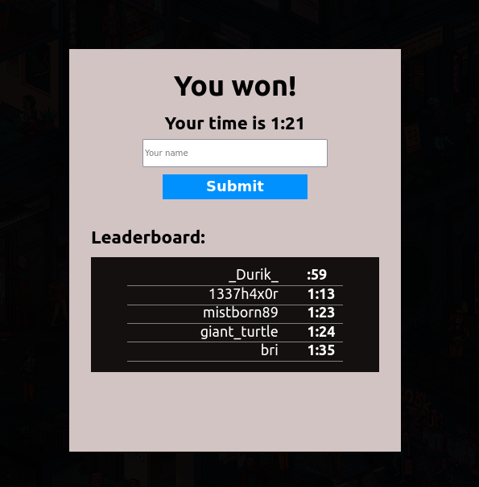

# ufoundme!


## About this project

This is a solution to the Odin's Project's [assignment](https://www.theodinproject.com/lessons/node-path-javascript-where-s-waldo-a-photo-tagging-app) to create a Where's-Waldo-like photo tagging game. In this version, you'll have to find three objects/characters in a busy cyberpunk city.

Once you find all three locations, you can submit your name and score. A leaderboard displays which will show how your well you did against the top five players. The correct locations for all three objects and top scores are stored in the backend via Firestore.



## Live project demo

:point_right: [Click here](https://foundme-spghtti.web.app/) :point_left:

## Run locally

```
git clone https://github.com/spghtti/ufoundme.git
cd ufoundme
npm install
npm start
```

## Built With

- [HTML](https://developer.mozilla.org/en-US/docs/Web/HTML)
- [CSS3](https://developer.mozilla.org/en-US/docs/Web/CSS)
- [Create-React-App](https://create-react-app.dev/)
- [Firebase](https://firebase.google.com/)

## License

Distributed under the MIT License. See LICENSE.txt for more information.
